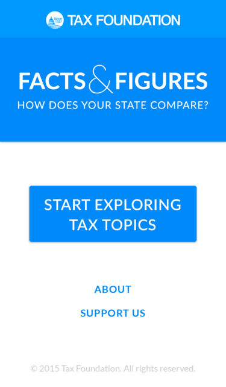

# Facts and Figures App Plan

## About This Project

The Tax Foundation has published [Facts and Figures](https://github.com/TaxFoundation/data/tree/master/facts-and-figures/2015) since 1941. In it's current incarnation, it includes statistics for all 50 states and DC across a broad array of tax topics. This data is published as a [quick reference book](http://taxfoundation.org/article/facts-figures-2015-how-does-your-state-compare), ideally for use by state legislators to see how their states' taxes compare. But this format alone is no longer sufficient; our data needs to be digital-first and readily accessible with smartphones. This is the Request For Proposal for transitioning Facts and Figures to an application for iOS and Android.

## Design and Function

This InVision demo shows the app structure we are looking for. The exact style may vary by platform, though [brand-specific elements](https://github.com/TaxFoundation/brand-assets) should be retained.

[See mockup here.](https://invis.io/QZ54U1E9H) Download assets used in mockup [here](https://www.dropbox.com/s/4xas4p15jdm0v9i/Facts%20%26%20Figures%20App.zip).

## App Requirements

* Must support iOS and Android (could be two native apps, or one hybrid framework app)
* Must be easy to navigate to specific information, or to simply browse
* Tables of data should be sortable
* Must be updateable with new tax data as it's available
* Allow users to make a donation to the Tax Foundation from within the app

## Work Process Requirements

* Development must take place in a private GitHub repo (or multiple repos) controlled by the Tax Foundation, to which developers will be given full access. This will allow the Tax Foundation to watch progress, and to help out as requested (e.g., providing graphic assets or structured tax data).
* To keep things simple, platform default styles are acceptable (e.g., Material for Android).
* Full source code used during the project will be delivered to the Tax Foundation upon completion.
* Full documentation of how to update the app/data will be delivered to the Tax Foundation.
* Developer will submit apps to Play Store and App Store on behalf of the Tax Foundation upon our approval.
* The Tax Foundation will pay for services 33% upfront, 33% upon completion, and 34% upon acceptance to the Apple App Store.

## Proposal Submission

To submit a proposal or ask for further details, please contact [Tom VanAntwerp](mailto:vanantwerp@taxfoundation.org), Tax Foundation's Director of IT.
